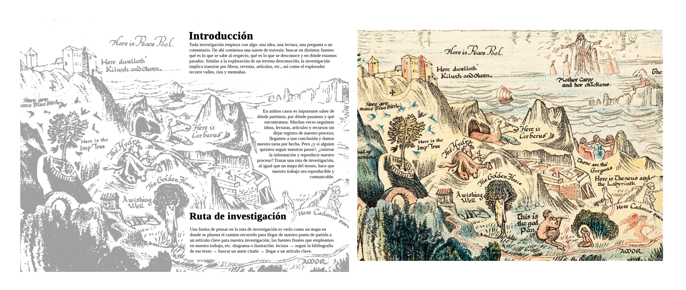
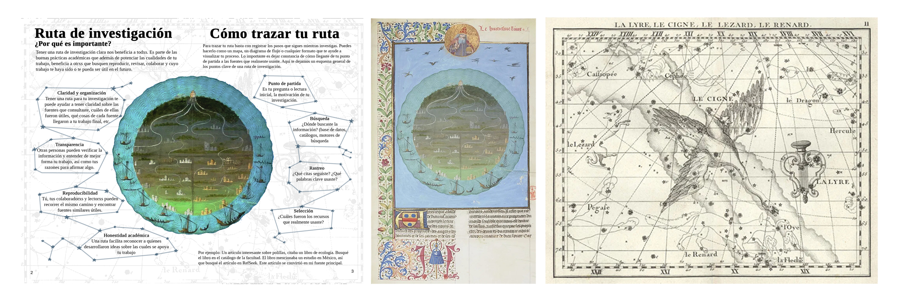
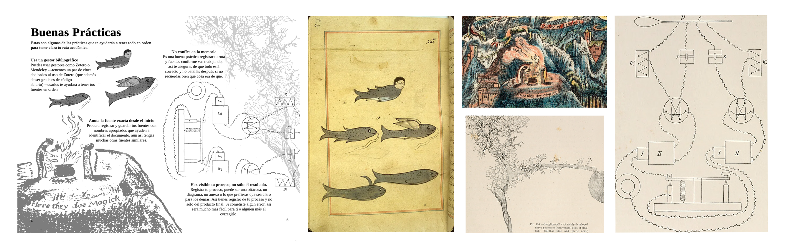

# Imágenes del Zine "Rutas de Investigación"

Esta carpeta contiene una descripción de las imágenes empleadas para la elaboración del zine "Rutas de Intestigación"

## Introducción

Detalles de "An Anciente Mappe of Fairyland" por Bernard Sleigh, c. 1920. Cortesía del Norman B. Leventhal Map & Education Center, vía The Public Domain Review. Disponible en https://publicdomainreview.org/collection/an-anciente-mappe-of-fairyland/

Public Domain No Additional Rights

## Ruta de Investigación - Cómo trazar tu ruta

Izquierda: Detalle de "Iluminación: Evrard d'Espinques, para De Proprietatibus Rerum", c. 1480. Bibliothèque nationale de France. vía The Public Domain Review. Disponible en https://publicdomainreview.org/collection/the-celestial-atlas-of-flamsteed-1795/

Public Domain Non commercial

Derecha: Carta estelar: John Flamsteed, Atlas Céleste, 1795. United States Naval Observatory Library, vía The Public Domain Review. Disponible en https://publicdomainreview.org/collection/the-celestial-atlas-of-flamsteed-1795/ 

Public Domain No Additional Rights

## Buenas Prácticas

Izquierda: Criatura fantástica: Zakariya al-Qazwini, Marvels of Things Created and Miraculous Aspects of Things Existing , c. siglo XVII. National Library of Medicine, vía The Public Domain Review. Disponible en https://publicdomainreview.org/collection/marvels-of-things-created-and-miraculous-aspects-of-things-existing/

Public Domain No Additional Rights

Centro, arriba: Detalles de "An Anciente Mappe of Fairyland" por Bernard Sleigh, c. 1920. Cortesía del Norman B. Leventhal Map & Education Center, vía The Public Domain Review. Disponible en https://publicdomainreview.org/collection/an-anciente-mappe-of-fairyland/

Public Domain No Additional Rights

Centro, abajo: Figura 158, pág 53 "Ganglion-cell with richly-developed nerve processes from ventral cord of crayfish" de Electro-physiology por Wilhelm Biedermann, 1896-98. Biodiversity Heritage Library, vía Internet Archive. Disponible en https://archive.org/details/electrophysiolog02bied/page/52/mode/2up

Public Domain

Derecha: Figura 200, pág 216 "Schema for simultaneous excitation of a nerve by induction shocks at different
points."  de Electro-physiology por Wilhelm Biedermann, 1896-98. Biodiversity Heritage Library, vía Internet Archive. Disponible en https://archive.org/details/electrophysiolog02bied/page/216/mode/2up

Public Domain

